# Icons

| Icon                                             | Name                                      | Icon Source                                                                                                                                           | Icon Guidelines                                                                                                                                           |
|:-------------------------------------------------|:------------------------------------------|:------------------------------------------------------------------------------------------------------------------------------------------------------|:----------------------------------------------------------------------------------------------------------------------------------------------------------|
|                          | .NET                                      | [Source](https://github.com/dotnet/brand/blob/main/logo/dotnet-logo.svg)                                                                              | [Guidelines](https://github.com/dotnet/brand)                                                                                                             |
|                     | ActivityPub                               | [Source](https://activitypub.rocks/)                                                                                                                  |                                                                                                                                                           |
|                        | Adafruit                                  | [Source](https://www.adafruit.com/)                                                                                                                   |                                                                                                                                                           |
|                     | AdGuard Home                              | [Source](https://github.com/AdguardTeam/AdGuardHome/blob/master/doc/adguard_home_lightmode.svg)                                                       |                                                                                                                                                           |
|                      | AdminerEvo                                | [Source](https://github.com/adminerevo/adminerevo/blob/main/docs/assets/logo.svg)                                                                     |                                                                                                                                                           |
|                       | AlmaLinux OS                              | [Source](https://almalinux.org/)                                                                                                                      | [Guidelines](https://almalinux.org/p/the-almalinux-os-trademark-usage-policy/)                                                                            |
|                     | Alpine Linux                              | [Source](https://www.alpinelinux.org/)                                                                                                                |                                                                                                                                                           |
|                          | Amazon                                    | [Source](https://en.wikipedia.org/wiki/Amazon_(company))                                                                                              |                                                                                                                                                           |
|                    | Amazon (smile)                            | [Source](https://en.wikipedia.org/wiki/Amazon_(company))                                                                                              |                                                                                                                                                           |
|               | Amazon Web Service (AWS)                  | [Source](https://en.wikipedia.org/wiki/Amazon_Web_Services)                                                                                           |                                                                                                                                                           |
|                             | AMD                                       | [Source](https://en.wikipedia.org/wiki/Advanced_Micro_Devices)                                                                                        | [Guidelines](https://www.amd.com/en/partner/marketing-materials)                                                                                          |
|                        | AMD (wide)                                | [Source](https://en.wikipedia.org/wiki/Advanced_Micro_Devices)                                                                                        |                                                                                                                                                           |
|                         | Android                                   | [Source](https://developer.android.com/distribute/marketing-tools/brand-guidelines)                                                                   | [Guidelines](https://about.google/brand-resource-center/)                                                                                                 |
|                   | Ansible (black)                           | [Source](https://www.ansible.com/logos)                                                                                                               | [Guidelines](https://www.ansible.com/logos)                                                                                                               |
|                    | Ansible (gray)                            | [Source](https://www.ansible.com/logos)                                                                                                               | [Guidelines](https://www.ansible.com/logos)                                                                                                               |
| 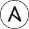                | Ansible (outline)                         | [Source](https://www.ansible.com/logos)                                                                                                               | [Guidelines](https://www.ansible.com/logos)                                                                                                               |
|                     | Ansible (red)                             | [Source](https://www.ansible.com/logos)                                                                                                               | [Guidelines](https://www.ansible.com/logos)                                                                                                               |
|                    | Ansible (teal)                            | [Source](https://www.ansible.com/logos)                                                                                                               | [Guidelines](https://www.ansible.com/logos)                                                                                                               |
|                 | Apache Cassandra                          | [Source](https://en.wikipedia.org/wiki/Apache_Cassandra)                                                                                              |                                                                                                                                                           |
|                 | Apache Guacamole                          | [Source](https://www.apache.org/logos/)                                                                                                               |                                                                                                                                                           |
|                     | Apache HTTPD                              | [Source](https://www.apache.org/logos/)                                                                                                               |                                                                                                                                                           |
| 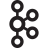                    | Apache Kafka                              | [Source](https://www.apache.org/logos/)                                                                                                               |                                                                                                                                                           |
|                | Apache OpenOffice                         | [Source](https://www.apache.org/logos/)                                                                                                               |                                                                                                                                                           |
|        | Apache Software Foundation                | [Source](https://www.apache.org/foundation/press/kit/)                                                                                                | [Guidelines](https://www.apache.org/foundation/press/kit/)                                                                                                |
|                      | Apache Solr                               | [Source](https://www.apache.org/logos/)                                                                                                               |                                                                                                                                                           |
|                | Apache Subversion                         | [Source](https://www.apache.org/logos/)                                                                                                               |                                                                                                                                                           |
| 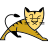                   | Apache Tomcat                             | [Source](https://www.apache.org/logos/)                                                                                                               |                                                                                                                                                           |
|                             | APC                                       | [Source](https://www.apc.com/us/en/)                                                                                                                  |                                                                                                                                                           |
|                        | AppImage                                  | [Source](https://github.com/AppImage/appimage.github.io/blob/master/img/logo3.svg)                                                                    |                                                                                                                                                           |
|                     | Apple (black)                             | [Source](https://en.wikipedia.org/wiki/Apple_Inc.)                                                                                                    |                                                                                                                                                           |
|                      | Apple (gray)                              | [Source](https://en.wikipedia.org/wiki/Apple_Inc.)                                                                                                    |                                                                                                                                                           |
|                   | Apple (rainbow)                           | [Source](https://en.wikipedia.org/wiki/Apple_Inc.)                                                                                                    |                                                                                                                                                           |
|                             | Arc                                       | [Source](https://arc.net/)                                                                                                                            |                                                                                                                                                           |
|                       | Arch Linux                                | [Source](https://archlinux.org/art/)                                                                                                                  | [Guidelines](https://wiki.archlinux.org/title/DeveloperWiki:TrademarkPolicy)                                                                              |
|                         | Arduino                                   | [Source](https://www.arduino.cc/en/trademark)                                                                                                         | [Guidelines](https://support.arduino.cc/hc/en-us/articles/4679102084892-Arduino-and-Community-logos)                                                      |
|                          | ArgoCD                                    | [Source](https://cncf-branding.netlify.app/projects/argo/)                                                                                            |                                                                                                                                                           |
|                             | ARM                                       | [Source](https://www.arm.com/company/policies/trademarks/guidelines-corporate-logo)                                                                   | [Guidelines](https://www.arm.com/company/policies/trademarks/guidelines-corporate-logo)                                                                   |
| 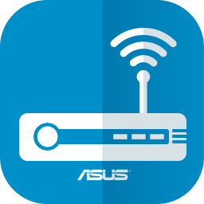                    | ASUS Router                               | [Source](https://play.google.com/store/apps/details?id=com.asus.aihome)                                                                               |                                                                                                                                                           |
|                       | Atlassian                                 | [Source](https://atlassian.design/resources/logo-library)                                                                                             | [Guidelines](https://atlassian.design/foundations/logos)                                                                                                  |
|                 | Atlassian Bamboo                          | [Source](https://atlassian.design/resources/logo-library)                                                                                             | [Guidelines](https://atlassian.design/foundations/logos)                                                                                                  |
|              | Atlassian Bitbucket                       | [Source](https://atlassian.design/resources/logo-library)                                                                                             | [Guidelines](https://atlassian.design/foundations/logos)                                                                                                  |
|             | Atlassian Confluence                      | [Source](https://atlassian.design/resources/logo-library)                                                                                             | [Guidelines](https://atlassian.design/foundations/logos)                                                                                                  |
|                   | Atlassian Jira                            | [Source](https://atlassian.design/resources/logo-library)                                                                                             | [Guidelines](https://atlassian.design/foundations/logos)                                                                                                  |
|               | Atlassian Opsgenie                        | [Source](https://atlassian.design/resources/logo-library)                                                                                             | [Guidelines](https://atlassian.design/foundations/logos)                                                                                                  |
|                 | Atlassian Trello                          | [Source](https://atlassian.design/resources/logo-library)                                                                                             | [Guidelines](https://atlassian.design/foundations/logos)                                                                                                  |
|                        | Audacity                                  | [Source](https://github.com/audacity/audacity/blob/master/images/audacity.svg)                                                                        |                                                                                                                                                           |
|                  | Audiobookshelf                            | [Source](https://github.com/advplyr/audiobookshelf/blob/master/client/static/icon.svg)                                                                |                                                                                                                                                           |
|                        | Auracast                                  | [Source](https://www.bluetooth.com/marketing-branding/)                                                                                               | [Guidelines](https://www.bluetooth.com/marketing-branding/)                                                                                               |
|                        | Authelia                                  | [Source](https://github.com/authelia/authelia/blob/master/docs/static/images/branding/logo.svg)                                                       |                                                                                                                                                           |
|                       | Authentik                                 | [Source](https://github.com/goauthentik/authentik/blob/main/website/static/img/icon_top_brand_colour.svg)                                             |                                                                                                                                                           |
|                         | autobrr                                   | [Source](https://github.com/autobrr/autobrr/issues/834)                                                                                               |                                                                                                                                                           |
|                       | AzuraCast                                 | [Source](https://docs.azuracast.com/en/press-kit)                                                                                                     | [Guidelines](https://docs.azuracast.com/en/press-kit)                                                                                                     |
|                       | Backblaze                                 | [Source](https://www.backblaze.com/partner/affiliate_resources.html)                                                                                  | [Guidelines](https://www.backblaze.com/company/news.html)                                                                                                 |
|                       | Bash (dark)                               | [Source](https://bashlogo.com/)                                                                                                                       | [Guidelines](https://github.com/odb/official-bash-logo)                                                                                                   |
|                      | Bash (light)                              | [Source](https://bashlogo.com/)                                                                                                                       | [Guidelines](https://github.com/odb/official-bash-logo)                                                                                                   |
|                          | Bazarr                                    | [Source](https://github.com/morpheus65535/bazarr/issues/2020)                                                                                         |                                                                                                                                                           |
|                         | Bitcoin                                   | [Source](https://bitcoin.org)                                                                                                                         |                                                                                                                                                           |
|                       | Bitwarden                                 | [Source](https://github.com/bitwarden/brand/blob/master/icons/icon.svg)                                                                               | [Guidelines](https://github.com/bitwarden/brand)                                                                                                          |
|                       | Bluetooth                                 | [Source](https://www.bluetooth.com/marketing-branding/)                                                                                               | [Guidelines](https://www.bluetooth.com/marketing-branding/)                                                                                               |
|                       | BookStack                                 | [Source](https://www.bookstackapp.com/)                                                                                                               |                                                                                                                                                           |
|                       | Bootstrap                                 | [Source](https://getbootstrap.com/docs/5.2/about/brand/)                                                                                              | [Guidelines](https://getbootstrap.com/docs/5.2/about/brand/)                                                                                              |
|                            | Borg                                      | [Source](https://github.com/borgbackup/borg/blob/master/docs/_static/logo.svg)                                                                        |                                                                                                                                                           |
|                        | Boundary                                  | [Source](https://www.hashicorp.com/brand)                                                                                                             | [Guidelines](https://www.hashicorp.com/brand)                                                                                                             |
|                           | Brave                                     | [Source](https://brave.com/brave-branding-assets/)                                                                                                    | [Guidelines](https://brave.com/brave-branding-assets/)                                                                                                    |
|                           | Bulma                                     | [Source](https://bulma.io/brand/)                                                                                                                     | [Guidelines](https://bulma.io/brand/)                                                                                                                     |
|                               | C                                         | Custom                                                                                                                                                |                                                                                                                                                           |
|                          | C#                                        | Custom                                                                                                                                                |                                                                                                                                                           |
|                       | C++                                       | [Source](https://github.com/isocpp/logos/blob/master/cpp_logo.svg)                                                                                    | [Guidelines](https://isocpp.org/home/terms-of-use)                                                                                                        |
|                           | Cacti                                     | [Source](https://www.cacti.net/)                                                                                                                      |                                                                                                                                                           |
|                           | Caddy                                     | [Source](https://github.com/caddyserver/website/blob/master/src/resources/images/caddy-logo.svg)                                                      |                                                                                                                                                           |
| 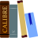                        | Calibre                                   | [Source](https://github.com/kovidgoyal/calibre/blob/master/imgsrc/calibre.svg)                                                                        |                                                                                                                                                           |
|                       | Canonical                                 | [Source](https://design.ubuntu.com/resources/)                                                                                                        | [Guidelines](https://design.ubuntu.com/brand/)                                                                                                            |
|              | Canonical Snapcraft                       | [Source](https://design.ubuntu.com/resources/)                                                                                                        | [Guidelines](https://design.ubuntu.com/brand/)                                                                                                            |
|                 | Canonical Ubuntu                          | [Source](https://design.ubuntu.com/resources/)                                                                                                        | [Guidelines](https://design.ubuntu.com/brand/)                                                                                                            |
|                          | CentOS                                    | [Source](https://wiki.centos.org/ArtWork/Brand/Logo)                                                                                                  | [Guidelines](https://wiki.centos.org/ArtWork/Brand/Logo)                                                                                                  |
|                            | Ceph                                      | [Source](https://ceph.io)                                                                                                                             |                                                                                                                                                           |
|                     | cert-manager                              | [Source](https://github.com/cert-manager/cert-manager/blob/master/logo/logo.svg)                                                                      |                                                                                                                                                           |
|                 | changedetection                           | [Source](https://github.com/dgtlmoon/changedetection.io/blob/master/changedetectionio/static/images/generic-icon.svg)                                 |                                                                                                                                                           |
|                         | checkmk                                   | [Source](https://checkmk.com/company/brand-assets)                                                                                                    | [Guidelines](https://checkmk.com/company/brand-assets)                                                                                                    |
|                        | Chromium                                  | [Source](https://en.wikipedia.org/wiki/Chromium_(web_browser))                                                                                        |                                                                                                                                                           |
|                        | CircleCI                                  | [Source](https://circleci.com/)                                                                                                                       | [Guidelines](https://circleci.com/legal/trademark-guidelines/)                                                                                            |
|  | Cloud Native Computing Foundation (CNCF)  | [Source](https://www.cncf.io/brand-guidelines/)                                                                                                       | [Guidelines](https://www.cncf.io/brand-guidelines/)                                                                                                       |
|                     | CloudBeaver                               | [Source](https://demo.cloudbeaver.io/)                                                                                                                |                                                                                                                                                           |
|                      | Cloudflare                                | [Source](https://www.cloudflare.com/logo/)                                                                                                            | [Guidelines](https://www.cloudflare.com/logo/)                                                                                                            |
|                 | Cloudflare Pages                          | [Source](https://pages.cloudflare.com/)                                                                                                               |                                                                                                                                                           |
|                         | Cockpit                                   | [Source](https://github.com/cockpit-project/cockpit/blob/main/src/branding/default/logo.svg)                                                          |                                                                                                                                                           |
|                        | Codeberg                                  | [Source](https://codeberg.org/Codeberg/Design/src/branch/main/logo/icon/svg/codeberg-logo_icon_blue.svg)                                              |                                                                                                                                                           |
|                        | Composer                                  | [Source](https://github.com/composer/composer/issues/4403)                                                                                            |                                                                                                                                                           |
|                          | Consul                                    | [Source](https://www.hashicorp.com/brand)                                                                                                             | [Guidelines](https://www.hashicorp.com/brand)                                                                                                             |
|                          | cPanel                                    | [Source](https://cpanel.net/company/cpanel-brand-guide/)                                                                                              | [Guidelines](https://cpanel.net/company/cpanel-brand-guide/)                                                                                              |
|                        | CrowdSec                                  | [Source](https://www.crowdsec.net/)                                                                                                                   |                                                                                                                                                           |
|                            | CSS3                                      | [Source](https://en.wikipedia.org/wiki/CSS)                                                                                                           |                                                                                                                                                           |
|                            | curl                                      | [Source](https://curl.se/logo/)                                                                                                                       | [Guidelines](https://curl.se/logo/)                                                                                                                       |
|                       | CyberChef                                 | [Source](https://github.com/gchq/CyberChef/blob/master/src/web/static/images/logo/cyberchef_hat.svg)                                                  |                                                                                                                                                           |
|                         | Datadog (Bits)                            | [Source](https://www.datadoghq.com/about/resources/)                                                                                                  | [Guidelines](https://www.datadoghq.com/about/resources/)                                                                                                  |
|                          | Debian                                    | [Source](https://www.debian.org/logos/)                                                                                                               | [Guidelines](https://www.debian.org/logos/)                                                                                                               |
|                            | Dell                                      | [Source](https://en.wikipedia.org/wiki/Dell)                                                                                                          |                                                                                                                                                           |
|                          | Deluge                                    | [Source](https://git.deluge-torrent.org/deluge/tree/deluge/ui/data/icons/hicolor/scalable/apps/deluge.svg)                                            |                                                                                                                                                           |
| 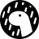                           | Deno                                      | [Source](https://github.com/denoland/dotland/blob/main/static/logo.svg)                                                                               |                                                                                                                                                           |
|                  | Diagrams.net (aka Draw.io)                | [Source](https://github.com/jgraph/drawio/blob/dev/src/main/webapp/images/drawlogo-color.svg)                                                         |                                                                                                                                                           |
|                    | DigitalOcean                              | [Source](https://www.digitalocean.com/press)                                                                                                          |                                                                                                                                                           |
|                         | Discord                                   | [Source](https://discord.com/branding)                                                                                                                | [Guidelines](https://discord.com/branding)                                                                                                                |
|                       | Discourse                                 | [Source](https://www.discourse.org/)                                                                                                                  |                                                                                                                                                           |
|                          | Docker                                    | [Source](https://github.com/docker/docs/blob/main/assets/images/docker-icon.svg)                                                                      | [Guidelines](https://www.docker.com/legal/trademark-guidelines/)                                                                                          |
|                     | Docker (Moby)                             | [Source](https://github.com/docker/docs/blob/main/assets/images/engine.svg)                                                                           | [Guidelines](https://www.docker.com/legal/trademark-guidelines/)                                                                                          |
|                          | Dockge                                    | [Source](https://github.com/louislam/dockge/blob/master/frontend/public/icon.svg)                                                                     |                                                                                                                                                           |
|                        | DokuWiki                                  | [Source](https://www.dokuwiki.org/logo)                                                                                                               | [Guidelines](https://www.dokuwiki.org/logo)                                                                                                               |
|                         | Dovecot                                   | [Source](https://en.wikipedia.org/wiki/Dovecot_(software))                                                                                            |                                                                                                                                                           |
|                          | Dozzle                                    | [Source](https://github.com/amir20/dozzle/blob/master/assets/favicon.svg)                                                                             |                                                                                                                                                           |
|                    | DragonFlyBSD                              | [Source](https://www.dragonflybsd.org/images/)                                                                                                        | [Guidelines](https://www.dragonflybsd.org/images/)                                                                                                        |
|                         | Drone CI                                  | [Source](https://github.com/drone/docs/blob/master/static/logo.svg)                                                                                   |                                                                                                                                                           |
|                          | Drupal                                    | [Source](https://www.drupal.org/about/media-kit/logos)                                                                                                | [Guidelines](https://www.drupal.org/about/media-kit/logo-wordmark-guidelines)                                                                             |
|                | Drupal (Druplicon)                        | [Source](https://www.drupal.org/about/media-kit/logos)                                                                                                | [Guidelines](https://www.drupal.org/about/media-kit/logo-wordmark-guidelines)                                                                             |
|                         | DuckDNS                                   | [Source](https://www.duckdns.org/)                                                                                                                    |                                                                                                                                                           |
|                      | DuckDuckGo (Dax)                          | [Source](https://duckduckgo.com/press)                                                                                                                |                                                                                                                                                           |
|                | Eclipse Mosquitto                         | [Source](https://github.com/eclipse/mosquitto/blob/master/logo/mosquitto-logo-only.svg)                                                               |                                                                                                                                                           |
|                         | Elastic Co.                               | [Source](https://en.wikipedia.org/wiki/Elastic_NV)                                                                                                    |                                                                                                                                                           |
|                   | Elastic Co. Beats                         | [Source](https://www.elastic.co/beats/)                                                                                                               |                                                                                                                                                           |
|           | Elastic Co. Elasticsearch                 | [Source](https://www.elastic.co/elasticsearch/)                                                                                                       |                                                                                                                                                           |
|                  | Elastic Co. Kibana                        | [Source](https://www.elastic.co/kibana/)                                                                                                              |                                                                                                                                                           |
|                | Elastic Co. Logstash                      | [Source](https://www.elastic.co/logstash/)                                                                                                            |                                                                                                                                                           |
|                        | Electron                                  | [Source](https://www.electronjs.org/)                                                                                                                 |                                                                                                                                                           |
|    | Electronic Frontier Foundation (EFF)      | [Source](https://www.eff.org/press/logos)                                                                                                             | [Guidelines](https://www.eff.org/pages/trademark-and-brand-usage-policy)                                                                                  |
|                         | Element                                   | [Source](https://element.io/)                                                                                                                         |                                                                                                                                                           |
|                    | elementary OS                             | [Source](https://elementary.io/brand)                                                                                                                 |                                                                                                                                                           |
|                           | Emacs                                     | [Source](https://git.savannah.gnu.org/cgit/emacs.git/tree/etc/images/icons/hicolor/scalable/apps/emacs.svg)                                           |                                                                                                                                                           |
|                            | Emby                                      | [Source](https://github.com/MediaBrowser/Emby.Resources/blob/master/images/svg_logos/EmbyLogo_Reconstruct_Step3_Outset_15.svg)                        |                                                                                                                                                           |
|                         | ESPHome                                   | [Source](https://esphome.io/images/index.html)                                                                                                        |                                                                                                                                                           |
|                       | Espressif                                 | [Source](https://www.espressif.com/)                                                                                                                  |                                                                                                                                                           |
|                            | etcd                                      | [Source](https://github.com/etcd-io/etcd/blob/main/logos/etcd-glyph-color.svg)                                                                        |                                                                                                                                                           |
|                  | Ethereum (black)                          | [Source](https://github.com/ethereum/ethereum-org-website/blob/dev/src/assets/assets/eth-diamond-black.svg)                                           |                                                                                                                                                           |
| 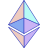               | Ethereum (colored)                        | [Source](https://github.com/ethereum/ethereum-org-website/blob/dev/src/assets/assets/eth-glyph-colored.svg)                                           |                                                                                                                                                           |
| 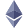                | Ethereum (purple)                         | [Source](https://github.com/ethereum/ethereum-org-website/blob/dev/src/assets/assets/eth-diamond-purple.svg)                                          |                                                                                                                                                           |
|                              | F5                                        | [Source](https://www.f5.com/company/news/press-kit)                                                                                                   | [Guidelines](https://www.f5.com/company/news/press-kit)                                                                                                   |
|                        | Facebook                                  | [Source](https://about.meta.com/brand/resources/facebookapp/logo/)                                                                                    | [Guidelines](https://about.meta.com/brand/resources/facebookapp/logo/)                                                                                    |
|                        | Fastmail                                  | [Source](https://www.fastmail.com/media-assets/)                                                                                                      | [Guidelines](https://www.fastmail.com/media-assets/)                                                                                                      |
|                         | Ferdium                                   | [Source](https://github.com/ferdium/ferdium-app/blob/develop/branding/ferdium-resources.svg)                                                          |                                                                                                                                                           |
|                     | File Browser                              | [Source](https://github.com/filebrowser/filebrowser/blob/master/frontend/public/img/logo.svg)                                                         |                                                                                                                                                           |
|                       | FileZilla                                 | [Source](https://en.wikipedia.org/wiki/FileZilla)                                                                                                     |                                                                                                                                                           |
|                     | Firefly III                               | [Source](https://github.com/firefly-iii/firefly-iii/blob/main/public/maskable-icon.svg)                                                               |                                                                                                                                                           |
|                         | Flathub                                   | [Source](https://github.com/flathub/website/blob/main/frontend/public/img/logo/flathub-logo-toolbar.svg)                                              |                                                                                                                                                           |
|                       | flatnotes                                 | [Source](https://github.com/dullage/flatnotes/blob/develop/docs/logo.svg)                                                                             |                                                                                                                                                           |
|                   | Flatpak (black)                           | [Source](https://flatpak.org/press/)                                                                                                                  |                                                                                                                                                           |
|                   | Flatpak (white)                           | [Source](https://flatpak.org/press/)                                                                                                                  |                                                                                                                                                           |
|                          | FluxCD                                    | [Source](https://github.com/fluxcd/website/blob/main/assets/icons/logo.svg)                                                                           |                                                                                                                                                           |
|                      | Focalboard                                | [Source](https://github.com/mattermost/focalboard/blob/main/webapp/static/favicon.svg)                                                                |                                                                                                                                                           |
| 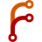                        | Forgejo                                   | [Source](https://codeberg.org/forgejo/forgejo)                                                                                                        |                                                                                                                                                           |
|                          | Fossil                                    | [Source](https://en.wikipedia.org/wiki/Fossil_(software))                                                                                             |                                                                                                                                                           |
|                       | Framework                                 | [Source](https://frame.work/)                                                                                                                         |                                                                                                                                                           |
|                         | FreeBSD                                   | [Source](https://freebsdfoundation.org/get-involved/brand-assets/)                                                                                    | [Guidelines](https://freebsdfoundation.org/legal/trademark-usage-terms-and-conditions/)                                                                   |
|                         | FreeIPA                                   | [Source](https://pagure.io/freeipa/issue/7362)                                                                                                        |                                                                                                                                                           |
|                         | FreeNAS                                   | [Source](https://github.com/truenas/webui/blob/master/src/assets/images/ix-original.svg)                                                              |                                                                                                                                                           |
|          | Free Software Foundation (FSF)            | [Source](https://www.gnu.org/graphics/fsf-logo.en.html)                                                                                               | [Guidelines](https://www.gnu.org/graphics/fsf-logo.en.html)                                                                                               |
|                        | FreshRSS                                  | [Source](https://github.com/FreshRSS/FreshRSS/blob/edge/docs/img/FreshRSS-logo.svg)                                                                   |                                                                                                                                                           |
|                         | Frigate                                   | [Source](https://github.com/blakeblackshear/frigate/blob/dev/docs/static/img/logo.svg)                                                                |                                                                                                                                                           |
|                          | Gatsby                                    | [Source](https://www.gatsbyjs.com/guidelines/logo)                                                                                                    | [Guidelines](https://www.gatsbyjs.com/guidelines/logo)                                                                                                    |
|                     | Gentoo Linux                              | [Source](https://www.gentoo.org/inside-gentoo/artwork/gentoo-logo.html)                                                                               | [Guidelines](https://www.gentoo.org/inside-gentoo/foundation/name-logo-guidelines.html)                                                                   |
|                            | GIMP (Wilber)                             | [Source](https://gitlab.gnome.org/Infrastructure/gimp-web/blob/master/themes/newgimp/static/images/gimp.svg)                                          | [Guidelines](https://www.gimp.org/about/linking.html)                                                                                                     |
|                             | Git                                       | [Source](https://git-scm.com/downloads/logos)                                                                                                         | [Guidelines](https://git-scm.com/downloads/logos)                                                                                                         |
|                         | GitBook                                   | [Source](https://www.gitbook.com/)                                                                                                                    |                                                                                                                                                           |
|                           | Gitea                                     | [Source](https://github.com/go-gitea/gitea/blob/main/assets/logo.svg)                                                                                 |                                                                                                                                                           |
|               | GitHub (Invertocat)                       | [Source](https://github.com/logos)                                                                                                                    | [Guidelines](https://github.com/logos)                                                                                                                    |
|                  | GitHub (Octocat)                          | [Source](https://github.com/logos)                                                                                                                    | [Guidelines](https://github.com/logos)                                                                                                                    |
|                          | GitLab (tanuki)                           | [Source](https://about.gitlab.com/press/press-kit/)                                                                                                   | [Guidelines](https://about.gitlab.com/handbook/marketing/brand-and-product-marketing/brand/brand-activation/trademark-guidelines/)                        |
|                           | Gnome                                     | [Source](https://foundation.gnome.org/logo-and-trademarks/)                                                                                           | [Guidelines](https://foundation.gnome.org/logo-and-trademarks/)                                                                                           |
|                          | Google                                    | [Source](https://en.wikipedia.org/wiki/Google)                                                                                                        | [Guidelines](https://about.google/brand-resource-center/)                                                                                                 |
|                  | Google Calendar                           | [Source](https://en.wikipedia.org/wiki/Google_Calendar)                                                                                               | [Guidelines](https://about.google/brand-resource-center/)                                                                                                 |
|                    | Google Chrome                             | [Source](https://en.wikipedia.org/wiki/Google_Chrome)                                                                                                 | [Guidelines](https://about.google/brand-resource-center/)                                                                                                 |
|             | Google Cloud Platform (GCP)               | [Source](https://en.wikipedia.org/wiki/Google_Cloud_Platform)                                                                                         | [Guidelines](https://about.google/brand-resource-center/)                                                                                                 |
|                     | Google Drive                              | [Source](https://en.wikipedia.org/wiki/Google_Drive)                                                                                                  | [Guidelines](https://about.google/brand-resource-center/)                                                                                                 |
|                  | Google Firebase                           | [Source](https://firebase.google.com/brand-guidelines/)                                                                                               | [Guidelines](https://firebase.google.com/brand-guidelines/)                                                                                               |
|                      | Google Mail (Gmail)                       | [Source](https://en.wikipedia.org/wiki/Gmail)                                                                                                         | [Guidelines](https://about.google/brand-resource-center/)                                                                                                 |
|                             | GNU (Heckert)                             | [Source](https://www.gnu.org/graphics/heckert_gnu.en.html)                                                                                            | [Guidelines](https://www.gnu.org/graphics/heckert_gnu.en.html)                                                                                            |
|                           | GnuPG                                     | [Source](https://en.wikipedia.org/wiki/GNU_Privacy_Guard)                                                                                             |                                                                                                                                                           |
|                        | Go (black)                                | [Source](https://go.dev/blog/go-brand)                                                                                                                | [Guidelines](https://go.dev/blog/go-brand)                                                                                                                |
|                         | Go (blue)                                 | [Source](https://go.dev/blog/go-brand)                                                                                                                | [Guidelines](https://go.dev/blog/go-brand)                                                                                                                |
|                          | Gotify                                    | [Source](https://github.com/gotify/logo/blob/master/gotify-logo.svg)                                                                                  |                                                                                                                                                           |
|                         | Grafana                                   | [Source](https://github.com/grafana/grafana/blob/main/public/img/grafana_icon.svg)                                                                    |                                                                                                                                                           |
|                     | Grafana Loki                              | [Source](https://grafana.com/oss/loki/)                                                                                                               |                                                                                                                                                           |
|                      | GrapheneOS                                | [Source](https://github.com/GrapheneOS/branding-extra/blob/main/simple.svg)                                                                           |                                                                                                                                                           |
|                            | Grav                                      | [Source](https://getgrav.org/media)                                                                                                                   |                                                                                                                                                           |
|                         | Graylog                                   | [Source](https://www.graylog.org/)                                                                                                                    |                                                                                                                                                           |
|                | GreenBone OpenVAS                         | [Source](https://greenbone.github.io/docs/latest/)                                                                                                    |                                                                                                                                                           |
|                           | Grocy                                     | [Source](https://github.com/grocy/grocy/blob/master/public/img/grocy_logo.svg)                                                                        |                                                                                                                                                           |
|                          | Harbor                                    | [Source](https://cncf-branding.netlify.app/projects/harbor/)                                                                                          |                                                                                                                                                           |
|                       | Harvester                                 | [Source](https://www.rancher.com/brand-guidelines)                                                                                                    | [Guidelines](https://www.rancher.com/brand-guidelines)                                                                                                    |
|                 | HashiCorp (black)                         | [Source](https://www.hashicorp.com/brand)                                                                                                             | [Guidelines](https://www.hashicorp.com/brand)                                                                                                             |
|                 | HashiCorp (white)                         | [Source](https://www.hashicorp.com/brand)                                                                                                             | [Guidelines](https://www.hashicorp.com/brand)                                                                                                             |
|                       | headscale                                 | [Source](https://github.com/juanfont/headscale/blob/main/docs/logo/headscale3-dots.svg)                                                               |                                                                                                                                                           |
|                        | HedgeDoc                                  | [Source](https://github.com/hedgedoc/hedgedoc-logo/blob/main/LOGOTYPE/SVG/HedgeDoc-Logo%201.svg)                                                      | [Guidelines](https://github.com/hedgedoc/hedgedoc-logo/blob/main/USAGE_GUIDELINES.md)                                                                     |
|                            | Helm                                      | [Source](https://helm.sh/)                                                                                                                            |                                                                                                                                                           |
|                          | Heroku                                    | [Source](https://devcenter.heroku.com/articles/heroku-brand-guidelines)                                                                               | [Guidelines](https://devcenter.heroku.com/articles/heroku-brand-guidelines)                                                                               |
|                         | Hetzner                                   | [Source](https://www.hetzner.com/)                                                                                                                    |                                                                                                                                                           |
|                          | Homarr                                    | [Source](https://github.com/ajnart/homarr/blob/dev/public/imgs/logo/logo.svg)                                                                         |                                                                                                                                                           |
|                   | Home Assistant                            | [Source](https://github.com/home-assistant/assets/blob/master/logo/logo.svg)                                                                          | [Guidelines](https://design.home-assistant.io/#brand/logo)                                                                                                |
|             | Home Assistant (small)                    | [Source](https://github.com/home-assistant/assets/blob/master/logo/logo-small.svg)                                                                    | [Guidelines](https://design.home-assistant.io/#brand/logo)                                                                                                |
|                         | Homebox                                   | [Source](https://hay-kot.github.io/homebox/)                                                                                                          |                                                                                                                                                           |
|                        | Homebrew                                  | [Source](https://github.com/Homebrew/brew.sh/blob/master/assets/img/homebrew.svg)                                                                     |                                                                                                                                                           |
|                           | Homer                                     | [Source](https://github.com/bastienwirtz/homer/blob/main/public/assets/icons/logo.svg)                                                                |                                                                                                                                                           |
|                        | HP (black)                                | [Source](https://brandcentral.hp.com/us/en/elements/hp-logo.html)                                                                                     | [Guidelines](https://brandcentral.hp.com/us/en/elements/hp-logo.html)                                                                                     |
|                        | HP (white)                                | [Source](https://brandcentral.hp.com/us/en/elements/hp-logo.html)                                                                                     | [Guidelines](https://brandcentral.hp.com/us/en/elements/hp-logo.html)                                                                                     |
|                           | HTML5                                     | [Source](https://www.w3.org/html/logo/)                                                                                                               | [Guidelines](https://www.w3.org/html/logo/)                                                                                                               |
|                          | Huginn                                    | [Source](https://github.com/huginn/huginn/blob/master/media/huginn-icon.svg)                                                                          |                                                                                                                                                           |
|                            | Hugo                                      | [Source](https://gohugo.io/)                                                                                                                          |                                                                                                                                                           |
|                  | IBM 8-bar (black)                         | [Source](https://www.ibm.com/design/language/ibm-logos/8-bar/)                                                                                        | [Guidelines](https://www.ibm.com/design/language/ibm-logos/8-bar/)                                                                                        |
|                   | IBM 8-bar (blue)                          | [Source](https://www.ibm.com/design/language/ibm-logos/8-bar/)                                                                                        | [Guidelines](https://www.ibm.com/design/language/ibm-logos/8-bar/)                                                                                        |
|                 | IBM Rebus (black)                         | [Source](https://www.ibm.com/design/language/ibm-logos/rebus)                                                                                         | [Guidelines](https://www.ibm.com/design/language/ibm-logos/rebus)                                                                                         |
|                  | IBM Rebus (blue)                          | [Source](https://www.ibm.com/design/language/ibm-logos/rebus)                                                                                         | [Guidelines](https://www.ibm.com/design/language/ibm-logos/rebus)                                                                                         |
|                          | Immich                                    | [Source](https://github.com/immich-app/immich/blob/main/design/immich-logo.svg)                                                                       |                                                                                                                                                           |
|                          | Influx                                    | [Source](https://influxdata.github.io/branding/logo/downloads/)                                                                                       | [Guidelines](https://influxdata.github.io/branding/logo/downloads/)                                                                                       |
|                        | Inkscape                                  | [Source](https://gitlab.com/inkscape/inkscape/-/blob/master/share/icons/application/scalable/org.inkscape.Inkscape.svg)                               |                                                                                                                                                           |
|                       | Instagram                                 | [Source](https://en.wikipedia.org/wiki/Instagram)                                                                                                     | [Guidelines](https://about.meta.com/brand/resources/instagram/instagram-brand/)                                                                           |
|                           | Intel                                     | [Source](https://en.wikipedia.org/wiki/Intel)                                                                                                         |                                                                                                                                                           |
|                    | Intel (circle)                            | [Source](https://en.wikipedia.org/wiki/Intel)                                                                                                         |                                                                                                                                                           |
|                       | Invidious                                 | [Source](https://github.com/iv-org/invidious/blob/master/assets/invidious-colored-vector.svg)                                                         |                                                                                                                                                           |
|                            | InterPlanetary File System (IPFS)         | [Source](https://github.com/ipfs/ipfs-website/blob/main/assets/icons/ipfs-logo.svg)                                                                   |                                                                                                                                                           |
|                           | Istio                                     | [Source](https://istio.io/v1.12/about/media-resources/)                                                                                               | [Guidelines](https://istio.io/v1.12/about/media-resources/)                                                                                               |
|                         | IT-Tools                                  | [Source](https://github.com/CorentinTh/it-tools/blob/main/public/safari-pinned-tab.svg)                                                               |                                                                                                                                                           |
|                       | iXsystems                                 | [Source](https://github.com/truenas/webui/blob/master/src/assets/images/ix-original.svg)                                                              |                                                                                                                                                           |
|                         | Jackett                                   | [Source](https://github.com/Jackett/Jackett/pull/9832)                                                                                                |                                                                                                                                                           |
|                          | Jaeger                                    | [Source](https://cncf-branding.netlify.app/projects/jaeger/)                                                                                          |                                                                                                                                                           |
|                        | Jamstack                                  | [Source](https://jamstack.org/logos/)                                                                                                                 | [Guidelines](https://jamstack.org/logos/)                                                                                                                 |
|                      | JavaScript                                | [Source](https://github.com/voodootikigod/logo.js/blob/master/js.svg)                                                                                 | [Guidelines](https://github.com/voodootikigod/logo.js)                                                                                                    |
|                          | Jekyll                                    | [Source](https://github.com/jekyll/brand/blob/master/jekyll-test-tube.svg)                                                                            |                                                                                                                                                           |
|                        | Jellyfin                                  | [Source](https://github.com/jellyfin/jellyfin-ux/blob/master/branding/SVG/icon-transparent.svg)                                                       | [Guidelines](https://jellyfin.org/docs/general/contributing/branding/#logo)                                                                               |
|                      | Jellyseerr                                | [Source](https://github.com/Fallenbagel/jellyseerr/blob/develop/public/logo_full.svg)                                                                 |                                                                                                                                                           |
|                         | Jenkins                                   | [Source](https://www.jenkins.io/artwork/)                                                                                                             | [Guidelines](https://www.jenkins.io/press/)                                                                                                               |
|                           | JFrog                                     | [Source](https://jfrog.com/)                                                                                                                          | [Guidelines](https://jfrog.com/brand-guidelines/)                                                                                                         |
|                | JFrog Artifactory                         | [Source](https://jfrog.com/)                                                                                                                          | [Guidelines](https://jfrog.com/brand-guidelines/)                                                                                                         |
|                           | Jitsi                                     | [Source](https://github.com/jitsi/handbook/blob/master/static/img/logo.svg)                                                                           |                                                                                                                                                           |
|                          | Joplin                                    | [Source](https://github.com/laurent22/joplin/blob/dev/Assets/JoplinIcon.svg)                                                                          |                                                                                                                                                           |
|                            | JSON                                      | [Source](https://en.wikipedia.org/wiki/JSON)                                                                                                          |                                                                                                                                                           |
|                         | Jupyter                                   | [Source](https://github.com/jupyter/design/blob/master/logos/Logo%20Mark/logomark-orangebody-greyplanets/logomark-orangebody-greyplanets.svg)         | [Guidelines](https://github.com/jupyter/design/blob/master/brandguide/brand_guide.pdf)                                                                    |
|                             | k0s                                       | [Source](https://github.com/k0sproject/k0sproject.github.io/blob/main/images/k0s-logo.svg)                                                            |                                                                                                                                                           |
| 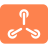                           | K3OS                                      | [Source](https://www.rancher.com/brand-guidelines)                                                                                                    | [Guidelines](https://www.rancher.com/brand-guidelines)                                                                                                    |
|                             | K3s                                       | [Source](https://www.rancher.com/brand-guidelines)                                                                                                    | [Guidelines](https://www.rancher.com/brand-guidelines)                                                                                                    |
|                       | Kali Linux                                | [Source](https://www.kali.org/)                                                                                                                       | [Guidelines](https://www.kali.org/docs/policy/trademark/)                                                                                                 |
|                        | Kanboard                                  | [Source](https://github.com/kanboard/kanboard/blob/main/assets/img/icon.svg)                                                                          |                                                                                                                                                           |
|                            | Kasm Workspaces                           | [Source](https://www.kasmweb.com)                                                                                                                     |                                                                                                                                                           |
|                          | Kavita                                    | [Source](https://github.com/Kareadita/Kavita/blob/develop/Logo/kavita.svg)                                                                            |                                                                                                                                                           |
|                            | Kbin                                      | [Source](https://codeberg.org/Kbin/kbin-core/src/branch/develop/public/kbin_logo.svg)                                                                 |                                                                                                                                                           |
|                             | KDE                                       | [Source](https://kde.org/stuff/clipart/)                                                                                                              | [Guidelines](https://kde.org/stuff/clipart/)                                                                                                              |
|                       | KDE Plasma                                | [Source](https://kde.org/stuff/clipart/)                                                                                                              | [Guidelines](https://kde.org/stuff/clipart/)                                                                                                              |
|                       | KeePassXC                                 | [Source](https://github.com/keepassxreboot/keepassxc/blob/develop/share/icons/application/scalable/apps/keepassxc.svg)                                |                                                                                                                                                           |
|                           | Kiwix                                     | [Source](https://en.wikipedia.org/wiki/Kiwix)                                                                                                         |                                                                                                                                                           |
|                            | Kodi                                      | [Source](https://kodi.tv/)                                                                                                                            |                                                                                                                                                           |
|                      | Kubernetes                                | [Source](https://github.com/kubernetes/kubernetes/blob/master/logo/logo.svg)                                                                          |                                                                                                                                                           |
| 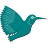                          | Latex                                     | [Source](https://www.latex-project.org/)                                                                                                              |                                                                                                                                                           |
|                      | Latex (wide)                              | [Source](https://www.latex-project.org/)                                                                                                              |                                                                                                                                                           |
|                           | Lemmy                                     | [Source](https://github.com/LemmyNet/lemmy-ui/blob/main/src/assets/icons/favicon.svg)                                                                 |                                                                                                                                                           |
|                          | Lenovo                                    | [Source](https://en.wikipedia.org/wiki/Lenovo)                                                                                                        |                                                                                                                                                           |
|                     | Let’s Encrypt                             | [Source](https://letsencrypt.org/trademarks/)                                                                                                         | [Guidelines](https://letsencrypt.org/trademarks/)                                                                                                         |
|                   | Libera.chat                               | [Source](https://libera.chat/)                                                                                                                        |                                                                                                                                                           |
|                 | Liberapay (black)                         | [Source](https://en.liberapay.com/about/logos)                                                                                                        | [Guidelines](https://en.liberapay.com/about/logos)                                                                                                        |
|                 | Liberapay (white)                         | [Source](https://en.liberapay.com/about/logos)                                                                                                        | [Guidelines](https://en.liberapay.com/about/logos)                                                                                                        |
|                  | LibreNMS (black)                          | [Source](https://github.com/librenms/librenms.github.io/blob/master/images/LibreNMS-Logo-Black.svg)                                                   |                                                                                                                                                           |
|                  | LibreNMS (white)                          | [Source](https://github.com/librenms/librenms.github.io/blob/master/images/LibreNMS-Logo.svg)                                                         |                                                                                                                                                           |
|                     | LibreOffice                               | [Source](https://wiki.documentfoundation.org/Gallery_Logos)                                                                                           | [Guidelines](https://wiki.documentfoundation.org/Design/Branding)                                                                                         |
|                          | Lidarr                                    | [Source](https://github.com/Lidarr/Lidarr/blob/develop/Logo/Lidarr.svg)                                                                               |                                                                                                                                                           |
|                       | LineageOS                                 | [Source](https://lineageos.org/)                                                                                                                      |                                                                                                                                                           |
|                        | LinkedIn                                  | [Source](https://en.wikipedia.org/wiki/LinkedIn)                                                                                                      |                                                                                                                                                           |
|                          | Linode                                    | [Source](https://www.linode.com/company/press/)                                                                                                       | [Guidelines](https://www.linode.com/company/press/)                                                                                                       |
|                           | Linux (Tux)                               | [Source](https://en.wikipedia.org/wiki/Linux)                                                                                                         |                                                                                                                                                           |
|                 | Linux Foundation                          | [Source](https://www.linuxfoundation.org/brand-guidelines)                                                                                            | [Guidelines](https://www.linuxfoundation.org/brand-guidelines)                                                                                            |
|                       | Linux Mint                                | [Source](https://github.com/linuxmint/brand-logo/blob/master/leaf.svg)                                                                                |                                                                                                                                                           |
|                   | LinuxServer.io                            | [Source](https://www.linuxserver.io/)                                                                                                                 |                                                                                                                                                           |
|                        | Longhorn                                  | [Source](https://www.rancher.com/brand-guidelines)                                                                                                    | [Guidelines](https://www.rancher.com/brand-guidelines)                                                                                                    |
|                             | LXC                                       | [Source](https://github.com/lxc/linuxcontainers.org/blob/master/static/img/containers.svg)                                                            |                                                                                                                                                           |
|                       | LXDE (gray)                               | [Source](https://github.com/lxde/lxde.github.io/blob/master/images/favicon.svg)                                                                       |                                                                                                                                                           |
|                      | LXDE (white)                              | [Source](https://github.com/lxde/lxde.github.io/blob/master/images/lxde-logo.svg)                                                                     |                                                                                                                                                           |
| 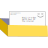                     | Mail-in-a-Box                             | [Source](https://github.com/mail-in-a-box/mailinabox.email/blob/main/static/logo.svg)                                                                 |                                                                                                                                                           |
|                         | mailcow                                   | [Source](https://github.com/mailcow/mailcow-dockerized/blob/master/data/web/img/cow_mailcow.svg)                                                      |                                                                                                                                                           |
|                         | Manjaro                                   | [Source](https://gitlab.manjaro.org/artwork/branding/logo/-/blob/master/logo.svg)                                                                     |                                                                                                                                                           |
|                         | MariaDB                                   | [Source](https://mariadb.com/about-us/logos/)                                                                                                         | [Guidelines](https://mariadb.com/about-us/logos/)                                                                                                         |
|                        | Markdown                                  | [Source](https://github.com/dcurtis/markdown-mark/blob/master/svg/markdown-mark.svg)                                                                  | [Guidelines](https://github.com/dcurtis/markdown-mark)                                                                                                    |
|                  | Markdown (solid)                          | [Source](https://github.com/dcurtis/markdown-mark/blob/master/svg/markdown-mark-solid.svg)                                                            | [Guidelines](https://github.com/dcurtis/markdown-mark)                                                                                                    |
|                        | Mastodon                                  | [Source](https://joinmastodon.org/branding)                                                                                                           | [Guidelines](https://joinmastodon.org/branding)                                                                                                           |
|            | Mastodon (no gradient)                    | [Source](https://joinmastodon.org/branding)                                                                                                           | [Guidelines](https://joinmastodon.org/branding)                                                                                                           |
|                | Mattermost (black)                        | [Source](https://handbook.mattermost.com/operations/operations/company-processes/publishing/publishing-guidelines/brand-and-visual-design-guidelines) | [Guidelines](https://handbook.mattermost.com/operations/operations/company-processes/publishing/publishing-guidelines/brand-and-visual-design-guidelines) |
|                 | Mattermost (blue)                         | [Source](https://handbook.mattermost.com/operations/operations/company-processes/publishing/publishing-guidelines/brand-and-visual-design-guidelines) | [Guidelines](https://handbook.mattermost.com/operations/operations/company-processes/publishing/publishing-guidelines/brand-and-visual-design-guidelines) |
|                    | Matrix (black)                            | [Source](https://matrix.org/)                                                                                                                         |                                                                                                                                                           |
|                    | Matrix (white)                            | [Source](https://matrix.org/)                                                                                                                         |                                                                                                                                                           |
|                         | MaxMind                                   | [Source](https://www.maxmind.com)                                                                                                                     |                                                                                                                                                           |
|                          | Mealie                                    | [Source](https://hay-kot.github.io/mealie/)                                                                                                           |                                                                                                                                                           |
|                 | MediaWiki (large)                         | [Source](https://www.mediawiki.org/wiki/Manual:MediaWiki_logo_guidelines)                                                                             | [Guidelines](https://www.mediawiki.org/wiki/Manual:MediaWiki_logo_guidelines)                                                                             |
|                | MediaWiki (medium)                        | [Source](https://www.mediawiki.org/wiki/Manual:MediaWiki_logo_guidelines)                                                                             | [Guidelines](https://www.mediawiki.org/wiki/Manual:MediaWiki_logo_guidelines)                                                                             |
|                 | MediaWiki (small)                         | [Source](https://www.mediawiki.org/wiki/Manual:MediaWiki_logo_guidelines)                                                                             | [Guidelines](https://www.mediawiki.org/wiki/Manual:MediaWiki_logo_guidelines)                                                                             |
|                       | Memcached                                 | [Source](https://en.wikipedia.org/wiki/Memcached)                                                                                                     |                                                                                                                                                           |
|                       | Mercurial                                 | [Source](https://www.mercurial-scm.org/hg-logo/)                                                                                                      | [Guidelines](https://www.mercurial-scm.org/hg-logo/)                                                                                                      |
|                       | Microsoft                                 | [Source](https://en.wikipedia.org/wiki/Microsoft)                                                                                                     |                                                                                                                                                           |
|                  | Microsoft Azure                           | [Source](https://en.wikipedia.org/wiki/Microsoft_Azure)                                                                                               |                                                                                                                                                           |
|                   | Microsoft Edge                            | [Source](https://en.wikipedia.org/wiki/Microsoft_Edge)                                                                                                |                                                                                                                                                           |
|             | Microsoft PowerShell                      | [Source](https://github.com/PowerShell/PowerShell/blob/master/assets/powershell_128.svg)                                                              | [Guidelines](https://learn.microsoft.com/en-us/powershell/scripting/community/digital-art)                                                                |
|              | Microsoft SQL Server                      | [Source](https://de.wikipedia.org/wiki/Microsoft_SQL_Server)                                                                                          |                                                                                                                                                           |
|                        | MikroTik                                  | [Source](https://merch.mikrotik.com/pages/mikrotik-logo)                                                                                              | [Guidelines](https://merch.mikrotik.com/pages/mikrotik-logo)                                                                                              |
|                        | Miniflux                                  | [Source](https://github.com/miniflux/logo/blob/master/icon.svg)                                                                                       |                                                                                                                                                           |
|                        | minikube                                  | [Source](https://github.com/kubernetes/minikube/blob/master/images/logo/logo.svg)                                                                     |                                                                                                                                                           |
|                           | MinIO                                     | [Source](https://min.io/)                                                                                                                             |                                                                                                                                                           |
|                          | Monero                                    | [Source](https://www.getmonero.org/press-kit/)                                                                                                        |                                                                                                                                                           |
|                          | Monica                                    | [Source](https://github.com/monicahq/monica/blob/main/public/img/monica.svg)                                                                          |                                                                                                                                                           |
|            | MongoDB (forest green)                    | [Source](https://www.mongodb.com/brand-resources)                                                                                                     | [Guidelines](https://www.mongodb.com/brand-resources)                                                                                                     |
|            | MongoDB (spring green)                    | [Source](https://www.mongodb.com/brand-resources)                                                                                                     | [Guidelines](https://www.mongodb.com/brand-resources)                                                                                                     |
|                         | Mozilla                                   | [Source](https://mozilla.design/mozilla/)                                                                                                             | [Guidelines](https://mozilla.design/mozilla/)                                                                                                             |
|                  | Mozilla Firefox                           | [Source](https://mozilla.design/firefox/)                                                                                                             | [Guidelines](https://mozilla.design/mozilla/)                                                                                                             |
|           | Mozilla Firefox Browser                   | [Source](https://mozilla.design/firefox/)                                                                                                             | [Guidelines](https://mozilla.design/mozilla/)                                                                                                             |
|       | Mozilla Firefox Browser Beta              | [Source](https://mozilla.design/firefox/)                                                                                                             | [Guidelines](https://mozilla.design/mozilla/)                                                                                                             |
|  | Mozilla Firefox Browser Developer Edition | [Source](https://mozilla.design/firefox/)                                                                                                             | [Guidelines](https://mozilla.design/mozilla/)                                                                                                             |
|    | Mozilla Firefox Browser Nightly           | [Source](https://mozilla.design/firefox/)                                                                                                             | [Guidelines](https://mozilla.design/mozilla/)                                                                                                             |
|              | Mozilla Thunderbird                       | [Source](https://design.thunderbird.net/resources/logo)                                                                                               |                                                                                                                                                           |
|                            | MQTT                                      | [Source](https://mqtt.org/)                                                                                                                           |                                                                                                                                                           |
|                         | Mullvad                                   | [Source](https://mullvad.net/en/press/)                                                                                                               | [Guidelines](https://mullvad.net/en/press/)                                                                                                               |
| 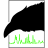                          | Munin                                     | [Source](https://github.com/munin-monitoring/munin/blob/master/web/static/img/logo-h.svg)                                                             |                                                                                                                                                           |
|                           | MySQL (Sakila)                            | [Source](https://www.mysql.com/about/legal/logos.html)                                                                                                | [Guidelines](https://www.mysql.com/about/legal/logos.html)                                                                                                |
| 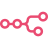                            | n8n                                       | [Source](https://n8n.io/)                                                                                                                             |                                                                                                                                                           |
|                       | Navidrome                                 | [Source](https://www.navidrome.org/)                                                                                                                  |                                                                                                                                                           |
| 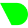                        | Netdata                                   | [Source](https://github.com/netdata/netdata/blob/master/web/gui/dashboard/images/netdata-logomark.svg)                                                |                                                                                                                                                           |
|                    | Netlify (dark)                            | [Source](https://www.netlify.com/press)                                                                                                               | [Guidelines](https://www.netlify.com/press)                                                                                                               |
|                   | Netlify (light)                           | [Source](https://www.netlify.com/press)                                                                                                               | [Guidelines](https://www.netlify.com/press)                                                                                                               |
|                          | NetBox                                    | [Source](https://docs.netbox.dev/)                                                                                                                    |                                                                                                                                                           |
| 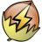                | Network UPS Tools (NUT)                   | [Source](https://github.com/networkupstools/nut/blob/master/docs/images/nut.svg)                                                                      |                                                                                                                                                           |
|                       | Nextcloud                                 | [Source](https://nextcloud.com/press/)                                                                                                                | [Guidelines](https://nextcloud.com/trademarks/)                                                                                                           |
|                           | Nginx                                     | [Source](https://www.nginx.com/)                                                                                                                      |                                                                                                                                                           |
|               | Nginx Proxy Manager                       | [Source](https://github.com/NginxProxyManager/nginx-proxy-manager/blob/develop/docs/.vuepress/public/logo.svg)                                        |                                                                                                                                                           |
|                          | Nitter                                    | [Source](https://github.com/zedeus/nitter/blob/master/public/safari-pinned-tab.svg)                                                                   |                                                                                                                                                           |
|                           | NixOS                                     | [Source](https://github.com/NixOS/nixos-artwork/blob/master/logo/nix-snowflake.svg)                                                                   | [Guidelines](https://github.com/NixOS/nixos-artwork)                                                                                                      |
|                 | NLnet Foundation                          | [Source](https://nlnet.nl/logo/)                                                                                                                      |                                                                                                                                                           |
|                       | NLnet Labs                                | [Source](https://www.nlnetlabs.nl/)                                                                                                                   |                                                                                                                                                           |
|                          | Node.js                                   | [Source](https://en.wikipedia.org/wiki/Node.js)                                                                                                       | [Guidelines](https://nodejs.org/static/documents/foundation-visual-guidelines.pdf)                                                                        |
|                         | Node-RED                                  | [Source](https://nodered.org/about/resources/)                                                                                                        |                                                                                                                                                           |
|                           | Nomad                                     | [Source](https://www.hashicorp.com/brand)                                                                                                             | [Guidelines](https://www.hashicorp.com/brand)                                                                                                             |
|                             | NPM                                       | [Source](https://github.com/npm/logos/blob/master/npm%20logo/npm-logo-red.svg)                                                                        |                                                                                                                                                           |
|                            | ntfy                                      | [Source](https://github.com/binwiederhier/ntfy/blob/main/web/src/img/ntfy.svg)                                                                        |                                                                                                                                                           |
|                          | Nvidia                                    | [Source](https://en.wikipedia.org/wiki/Nvidia)                                                                                                        | [Guidelines](https://www.nvidia.com/en-us/about-nvidia/legal-info/logo-brand-usage/)                                                                      |
|                     | Nvidia (wide)                             | [Source](https://en.wikipedia.org/wiki/Nvidia)                                                                                                        | [Guidelines](https://www.nvidia.com/en-us/about-nvidia/legal-info/logo-brand-usage/)                                                                      |
|                       | OBS Studio                                | [Source](https://github.com/obsproject/obs-studio/blob/master/UI/xdg-data/icons/obs-logo-scalable.svg)                                                |                                                                                                                                                           |
| 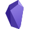                       | Obsidian                                  | [Source](https://obsidian.md/)                                                                                                                        |                                                                                                                                                           |
|                       | OctoPrint                                 | [Source](https://github.com/OctoPrint/OctoPrint/blob/master/src/octoprint/static/img/mask-theme.svg)                                                  | [Guidelines](https://octoprint.org/trademark-rules/)                                                                                                      |
|                            | Ombi                                      | [Source](https://github.com/Ombi-app/Ombi/blob/develop/assets/Ombi-icon.ai)                                                                           |                                                                                                                                                           |
|                          | OneDev                                    | [Source](https://code.onedev.io/onedev/server/~files/main/server-core/src/main/java/io/onedev/server/web/asset/icon/logo.svg)                         |                                                                                                                                                           |
|                    | OpenAI (black)                            | [Source](https://openai.com/)                                                                                                                         |                                                                                                                                                           |
|                    | OpenAI (white)                            | [Source](https://openai.com/)                                                                                                                         |                                                                                                                                                           |
|               | OpenAPI Initiative                        | [Source](https://github.com/OAI/OpenAPI-Style-Guide/blob/main/graphics/vector/OpenAPI_Logo_Pantone.svg)                                               | [Guidelines](https://www.openapis.org/faq/style-guide)                                                                                                    |
| 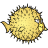                        | OpenBSD                                   | [Source](https://en.wikipedia.org/wiki/OpenBSD)                                                                                                       |                                                                                                                                                           |
|                  | Open Collective                           | [Source](https://opencollective.com/)                                                                                                                 |                                                                                                                                                           |
|                         | openHAB                                   | [Source](https://www.openhab.org/artwork.html)                                                                                                        | [Guidelines](https://www.openhab.org/about/trademark.html)                                                                                                |
|                         | OpenJDK (Duke)                            | [Source](https://wiki.openjdk.org/display/duke/Gallery)                                                                                               | [Guidelines](https://wiki.openjdk.org/display/duke/Main)                                                                                                  |
|                  | OpenMediaVault                            | [Source](https://github.com/openmediavault/openmediavault/blob/master/deb/openmediavault/workbench/src/favicon.svg)                                   |                                                                                                                                                           |
|                      | OpenSearch                                | [Source](https://opensearch.org/brand.html)                                                                                                           | [Guidelines](https://opensearch.org/brand.html)                                                                                                           |
|                       | OpenStack                                 | [Source](https://github.com/openwrt/branding/blob/master/logo/openwrt_logo_blue_and_dark_blue.svg)                                                    | [Guidelines](https://www.openstack.org/brand/openstack-logo/)                                                                                             |
|                        | openSUSE                                  | [Source](https://en.opensuse.org/openSUSE:Artwork_brand)                                                                                              | [Guidelines](https://en.opensuse.org/openSUSE:Trademark_guidelines)                                                                                       |
|                        | OpenTofu                                  | [Source](https://github.com/opentofu/brand-artifacts/blob/main/symbol-only/with-bg/SVG/on-light.svg)                                                  |                                                                                                                                                           |
|                         | OpenVPN                                   | [Source](https://openvpn.net/)                                                                                                                        |                                                                                                                                                           |
|                         | OpenWRT                                   | [Source](https://github.com/openwrt/branding/blob/master/logo/openwrt_logo_blue_and_dark_blue.svg)                                                    | [Guidelines](https://openwrt.org/docs/guide-graphic-designer/openwrt-logo)                                                                                |
|                         | OpenZFS                                   | [Source](https://en.wikipedia.org/wiki/OpenZFS)                                                                                                       | [Guidelines](https://openzfs.org/OpenZFS%20Guidelines.pdf)                                                                                                |
|         | Open Container Initiative                 | [Source](https://github.com/opencontainers/opencontainers.org/blob/master/static/img/logos/OCI-logo.svg)                                              |                                                                                                                                                           |
|              | Open Source Hardware                      | [Source](https://www.oshwa.org/open-source-hardware-logo/)                                                                                            | [Guidelines](https://www.oshwa.org/open-source-hardware-logo/)                                                                                            |
|            | Open Source Initiative                    | [Source](https://opensource.org/logo-usage-guidelines)                                                                                                | [Guidelines](https://opensource.org/logo-usage-guidelines)                                                                                                |
|                           | Opera                                     | [Source](https://brand.opera.com/1472-2/opera-logos/)                                                                                                 | [Guidelines](https://brand.opera.com/1472-2/opera-logos/)                                                                                                 |
|                        | OPNsense                                  | [Source](https://en.wikipedia.org/wiki/OPNsense)                                                                                                      | [Guidelines](https://opnsense.org/about/legal-notices/)                                                                                                   |
|                         | Outline                                   | [Source](https://github.com/outline/website/blob/main/public/images/logo.svg)                                                                         |                                                                                                                                                           |
|                       | Overseerr                                 | [Source](https://github.com/sct/overseerr/blob/develop/public/logo_full.svg)                                                                          |                                                                                                                                                           |
|                             | OVH                                       | [Source](https://www.ovhcloud.com/en/)                                                                                                                |                                                                                                                                                           |
|                        | ownCloud                                  | [Source](https://owncloud.com/trademark/)                                                                                                             | [Guidelines](https://owncloud.com/trademark/)                                                                                                             |
|                          | Packer                                    | [Source](https://www.hashicorp.com/brand)                                                                                                             | [Guidelines](https://www.hashicorp.com/brand)                                                                                                             |
|                        | PairDrop (fork of SnapDrop)               | [Source](https://pairdrop.net/)                                                                                                                       |                                                                                                                                                           |
|                | Palo Alto Networks                        | [Source](https://www.paloaltonetworks.com/company/brand)                                                                                              | [Guidelines](https://www.paloaltonetworks.com/company/brand)                                                                                              |
|                     | Paperless-ng                              | [Source](https://github.com/jonaswinkler/paperless-ng/blob/master/src-ui/src/assets/logo.svg)                                                         |                                                                                                                                                           |
|                        | PeerTube                                  | [Source](https://joinpeertube.org/)                                                                                                                   |                                                                                                                                                           |
|                            | Perl                                      | [Source](https://github.com/tpf/marketing-materials/blob/master/images/onion-logo/tpf-logo-onion.svg)                                                 | [Guidelines](https://www.perlfoundation.org/trademarks.html)                                                                                              |
|                   | pfSense (black)                           | [Source](https://en.wikipedia.org/wiki/PfSense)                                                                                                       |                                                                                                                                                           |
|                    | pfSense (blue)                            | [Source](https://en.wikipedia.org/wiki/PfSense)                                                                                                       |                                                                                                                                                           |
| 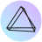                     | PhotoPrism                                | [Source](https://github.com/photoprism/photoprism/blob/develop/assets/static/img/logo.svg)                                                            |                                                                                                                                                           |
|                             | PHP                                       | [Source](https://www.php.net/download-logos.php)                                                                                                      | [Guidelines](https://www.php.net/download-logos.php)                                                                                                      |
|                      | phpMyAdmin                                | [Source](https://github.com/phpmyadmin/data/blob/master/brand/phpMyAdmin-Logo-Symbol.svg)                                                             |                                                                                                                                                           |
|                          | Pi-hole                                   | [Source](https://github.com/pi-hole/graphics/blob/master/Vortex/Vortex.svg)                                                                           | [Guidelines](https://pi-hole.net/trademark-rules-and-brand-guidelines/)                                                                                   |
|                           | PiKVM                                     | [Source](https://pikvm.org/)                                                                                                                          |                                                                                                                                                           |
|                           | Plane                                     | [Source](https://github.com/makeplane/plane/blob/develop/web/public/plane-logos/black-horizontal-with-blue-logo.svg)                                  |                                                                                                                                                           |
|                       | Plausible                                 | [Source](https://github.com/plausible/docs/blob/master/static/img/logo.svg)                                                                           |                                                                                                                                                           |
|                      | Plex (black)                              | [Source](https://brand.plex.tv)                                                                                                                       | [Guidelines](https://brand.plex.tv)                                                                                                                       |
|                      | Plex (white)                              | [Source](https://brand.plex.tv)                                                                                                                       | [Guidelines](https://brand.plex.tv)                                                                                                                       |
| 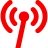                   | Podcast Index                             | [Source](https://podcastindex.org/)                                                                                                                   |                                                                                                                                                           |
|                          | Podman                                    | [Source](https://podman.io/)                                                                                                                          |                                                                                                                                                           |
|                           | Pop!_OS                                   | [Source](https://github.com/system76/brand/blob/master/Pop_OS%20branding/Pop_icon.svg)                                                                | [Guidelines](https://system76.com/about)                                                                                                                  |
|                       | Portainer                                 | [Source](https://github.com/portainer/portainer/blob/develop/app/assets/images/logo_alt.svg)                                                          |                                                                                                                                                           |
|                      | PostgreSQL (Slonik)                       | [Source](https://wiki.postgresql.org/wiki/Logo)                                                                                                       | [Guidelines](https://www.postgresql.org/about/policies/trademarks/)                                                                                       |
|                         | Pritunl                                   | [Source](https://github.com/pritunl/pritunl/blob/master/www/img/logo.svg)                                                                             |                                                                                                                                                           |
|                      | PrivateBin                                | [Source](https://github.com/PrivateBin/PrivateBin/blob/master/img/logo.svg)                                                                           |                                                                                                                                                           |
|           | Private Internet Access (PIA)             | [Source](https://www.privateinternetaccess.com/)                                                                                                      |                                                                                                                                                           |
|                      | Prometheus                                | [Source](https://github.com/prometheus/prometheus/blob/main/documentation/images/prometheus-logo.svg)                                                 |                                                                                                                                                           |
|                          | Proton                                    | [Source](https://proton.me/media/kit)                                                                                                                 | [Guidelines](https://proton.me/media/kit)                                                                                                                 |
|                        | Prowlarr                                  | [Source](https://github.com/Prowlarr/Prowlarr/blob/develop/Logo/Prowlarr.svg)                                                                         |                                                                                                                                                           |
|                         | Proxmox                                   | [Source](https://en.wikipedia.org/wiki/Proxmox_Virtual_Environment)                                                                                   | [Guidelines](https://www.proxmox.com/en/news/media-kit)                                                                                                   |
|                          | Pulumi                                    | [Source](https://www.pulumi.com/brand/)                                                                                                               | [Guidelines](https://www.pulumi.com/brand/)                                                                                                               |
|                        | Pushover                                  | [Source](https://support.pushover.net/i63-pushover-logos-and-usage)                                                                                   | [Guidelines](https://support.pushover.net/i63-pushover-logos-and-usage)                                                                                   |
|                           | PuTTY                                     | [Source](https://en.wikipedia.org/wiki/PuTTY)                                                                                                         |                                                                                                                                                           |
|                          | Python                                    | [Source](https://www.python.org/community/logos/)                                                                                                     | [Guidelines](https://www.python.org/psf/trademarks/)                                                                                                      |
|                            | PyPI                                      | [Source](https://pypi.org/)                                                                                                                           | [Guidelines](https://pypi.org/trademarks/)                                                                                                                |
|                     | qBittorrent                               | [Source](https://github.com/qbittorrent/qBittorrent/blob/master/src/icons/qbittorrent-tray.svg)                                                       |                                                                                                                                                           |
|                            | QEMU                                      | [Source](https://gitlab.com/qemu-project/qemu/-/blob/master/pc-bios/qemu_logo.svg)                                                                    |                                                                                                                                                           |
|                            | QNAP                                      | [Source](https://marketing.qnap.com/logo/)                                                                                                            | [Guidelines](https://marketing.qnap.com/logo/)                                                                                                            |
|                          | Radarr                                    | [Source](https://github.com/Radarr/Radarr/blob/develop/Logo/Radarr.svg)                                                                               |                                                                                                                                                           |
|                        | Radicale                                  | [Source](https://radicale.org/v3.html)                                                                                                                |                                                                                                                                                           |
|                         | Rancher                                   | [Source](https://www.rancher.com/brand-guidelines)                                                                                                    | [Guidelines](https://www.rancher.com/brand-guidelines)                                                                                                    |
|                     | Rapid7 (dark)                             | [Source](https://brand.rapid7.com/)                                                                                                                   | [Guidelines](https://brand.rapid7.com/)                                                                                                                   |
|                    | Rapid7 (light)                            | [Source](https://brand.rapid7.com/)                                                                                                                   | [Guidelines](https://brand.rapid7.com/)                                                                                                                   |
| 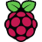                    | RaspberryPi                               | [Source](https://www.raspberrypi.org)                                                                                                                 | [Guidelines](https://static.raspberrypi.org/files/Raspberry_Pi_Visual_Guidelines.pdf)                                                                     |
|                          | Rclone                                    | [Source](https://github.com/rclone/rclone/blob/master/graphics/logo/svg/logo_symbol_color.svg)                                                        |                                                                                                                                                           |
|                         | Readarr                                   | [Source](https://github.com/Readarr/Readarr/blob/develop/Logo/Readarr.svg)                                                                            |                                                                                                                                                           |
|                          | Reddit (Snoo)                             | [Source](https://www.redditinc.com/brand)                                                                                                             | [Guidelines](https://www.redditinc.com/brand)                                                                                                             |
|                          | RedHat                                    | [Source](https://www.redhat.com/en/about/brand/standards/logo)                                                                                        | [Guidelines](https://www.redhat.com/en/about/brand/standards/logo)                                                                                        |
|                 | RedHat OpenShift                          | [Source](https://en.wikipedia.org/wiki/OpenShift)                                                                                                     |                                                                                                                                                           |
|                           | Redis                                     | [Source](https://redis.com/brand-guidelines/)                                                                                                         | [Guidelines](https://redis.com/brand-guidelines/)                                                                                                         |
|                           | RISC-V                                    | [Source](https://riscv.org/about/risc-v-branding-guidelines/)                                                                                         | [Guidelines](https://riscv.org/about/risc-v-branding-guidelines/)                                                                                         |
|                      | Rocky Linux                               | [Source](https://github.com/rocky-linux/rocky-logos/blob/main/icons/hicolor/scalable/apps/fedora-logo-icon.svg)                                       |                                                                                                                                                           |
|                            | RomM                                      | [Source](https://github.com/zurdi15/romm/blob/master/romm.svg)                                                                                        |                                                                                                                                                           |
|                       | Roundcube                                 | [Source](https://roundcube.net/)                                                                                                                      |                                                                                                                                                           |
|                            | Ruby                                      | [Source](https://www.ruby-lang.org/en/about/logo/)                                                                                                    | [Guidelines](https://www.ruby-lang.org/en/about/logo/)                                                                                                    |
|                            | Rust                                      | [Source](https://foundation.rust-lang.org/policies/logo-policy-and-media-guide/)                                                                      | [Guidelines](https://foundation.rust-lang.org/policies/logo-policy-and-media-guide/)                                                                      |
|                       | Rust (Ferris)                             | [Source](https://rustacean.net/)                                                                                                                      | [Guidelines](https://rustacean.net/)                                                                                                                      |
|                         | SABnzbd                                   | [Source](https://github.com/sabnzbd/sabnzbd/blob/develop/icons/logo-arrow.svg)                                                                        |                                                                                                                                                           |
|                          | Safari                                    | [Source](https://en.wikipedia.org/wiki/Safari_(web_browser))                                                                                          |                                                                                                                                                           |
|                        | Scaleway                                  | [Source](https://www.scaleway.com/en/design-resources/)                                                                                               | [Guidelines](https://www.scaleway.com/en/design-resources/)                                                                                               |
|                  | Scrutiny (black)                          | [Source](https://github.com/AnalogJ/scrutiny/blob/master/webapp/frontend/src/assets/images/logo/scrutiny-logo-dark.svg)                               |                                                                                                                                                           |
|                  | Scrutiny (white)                          | [Source](https://github.com/AnalogJ/scrutiny/blob/master/webapp/frontend/src/assets/images/logo/scrutiny-logo-white.svg)                              |                                                                                                                                                           |
|                         | Seafile                                   | [Source](https://de.wikipedia.org/wiki/Seafile)                                                                                                       |                                                                                                                                                           |
|                           | Searx                                     | [Source](https://github.com/searx/searx/blob/master/searx/static/themes/simple/img/searx_logo.svg)                                                    |                                                                                                                                                           |
|                         | SearXNG                                   | [Source](https://github.com/searxng/searxng/blob/master/src/brand/searxng-wordmark.svg)                                                               |                                                                                                                                                           |
|                     | SemVer (dark)                             | [Source](https://github.com/semver/semver.org/blob/gh-pages/assets/1000x600(light).svg)                                                               |                                                                                                                                                           |
|                    | SemVer (light)                            | [Source](https://github.com/semver/semver.org/blob/gh-pages/assets/1000x600(dark).svg)                                                                |                                                                                                                                                           |
|                     | Server Fault                              | [Source](https://serverfault.com/)                                                                                                                    | [Guidelines](https://stackoverflow.com/legal/trademark-guidance)                                                                                          |
|                          | Shelly                                    | [Source](https://info.shelly.cloud/media-assets/)                                                                                                     |                                                                                                                                                           |
|                          | Signal                                    | [Source](https://github.com/signalapp/Signal-Desktop/blob/main/images/signal-logo.svg)                                                                |                                                                                                                                                           |
|                           | Slack                                     | [Source](https://slack.com/media-kit)                                                                                                                 | [Guidelines](https://slack.com/media-kit)                                                                                                                 |
|                       | Smallstep                                 | [Source](https://smallstep.com/docs)                                                                                                                  |                                                                                                                                                           |
|                        | Snapchat                                  | [Source](https://en.wikipedia.org/wiki/Snapchat)                                                                                                      | [Guidelines](https://www.snap.com/en-US/brand-guidelines)                                                                                                 |
|     | Software in the Public Interest (SPI)     | [Source](https://www.spi-inc.org/)                                                                                                                    |                                                                                                                                                           |
|                            | SOGo                                      | [Source](https://www.sogo.nu/)                                                                                                                        |                                                                                                                                                           |
|                          | Sonarr                                    | [Source](https://github.com/Sonarr/Sonarr/blob/develop/Logo/Sonarr.svg)                                                                               |                                                                                                                                                           |
|                 | sourcehut (black)                         | [Source](https://sourcehut.org/logo/)                                                                                                                 | [Guidelines](https://sourcehut.org/logo/)                                                                                                                 |
|                 | sourcehut (white)                         | [Source](https://sourcehut.org/logo/)                                                                                                                 | [Guidelines](https://sourcehut.org/logo/)                                                                                                                 |
|                          | Splunk                                    | [Source](https://www.splunk.com/)                                                                                                                     |                                                                                                                                                           |
|                         | Spotify                                   | [Source](https://developer.spotify.com/documentation/design)                                                                                          | [Guidelines](https://developer.spotify.com/documentation/design)                                                                                          |
|                          | SQLite                                    | [Source](https://en.wikipedia.org/wiki/SQLite)                                                                                                        |                                                                                                                                                           |
|                   | Stack Exchange                            | [Source](https://stackoverflow.design/brand/logo/)                                                                                                    | [Guidelines](https://stackoverflow.com/legal/trademark-guidance)                                                                                          |
|                   | Stack Overflow                            | [Source](https://stackoverflow.design/brand/logo/)                                                                                                    | [Guidelines](https://stackoverflow.com/legal/trademark-guidance)                                                                                          |
|                           | Stash                                     | [Source](https://github.com/stashapp/Stash-Docs/blob/main/assets/logo.svg)                                                                            |                                                                                                                                                           |
|           | Static Web Server (white)                 | [Source](https://github.com/static-web-server/static-web-server/blob/master/docs/content/assets/sws_white.svg)                                        |                                                                                                                                                           |
|           | Static Web Server (black)                 | [Source](https://github.com/static-web-server/static-web-server/blob/master/docs/content/assets/sws.svg)                                              |                                                                                                                                                           |
|                           | Steam                                     | [Source](https://partner.steamgames.com/doc/marketing/branding)                                                                                       | [Guidelines](https://partner.steamgames.com/doc/marketing/branding)                                                                                       |
|                       | Steam Deck                                | [Source](https://partner.steamgames.com/doc/marketing/branding)                                                                                       | [Guidelines](https://partner.steamgames.com/doc/marketing/branding)                                                                                       |
|                         | SteamDB                                   | [Source](https://steamdb.info/)                                                                                                                       |                                                                                                                                                           |
|                     | Stirling PDF                              | [Source](https://github.com/Frooodle/Stirling-PDF/blob/main/docs/stirling-transparent.svg)                                                            |                                                                                                                                                           |
|                        | string.is                                 | [Source](https://github.com/recurser/string-is/blob/develop/src/images/logo.svg)                                                                      |                                                                                                                                                           |
|                        | Supabase                                  | [Source](https://supabase.com/brand-assets)                                                                                                           | [Guidelines](https://supabase.com/brand-assets)                                                                                                           |
|                      | Supermicro                                | [Source](https://www.supermicro.com/en/supermicro-logos)                                                                                              | [Guidelines](https://www.supermicro.com/en/supermicro-logos)                                                                                              |
|                       | Super User                                | [Source](https://superuser.com/)                                                                                                                      | [Guidelines](https://stackoverflow.com/legal/trademark-guidance)                                                                                          |
|                       | Syncthing                                 | [Source](https://github.com/syncthing/syncthing/blob/main/assets/logo-only.svg)                                                                       |                                                                                                                                                           |
|                  | Synology (black)                          | [Source](https://design.synology.com/elements/logo)                                                                                                   | [Guidelines](https://design.synology.com/elements/logo)                                                                                                   |
|              | Synology (two-color)                      | [Source](https://design.synology.com/elements/logo)                                                                                                   | [Guidelines](https://design.synology.com/elements/logo)                                                                                                   |
|                  | Synology (white)                          | [Source](https://design.synology.com/elements/logo)                                                                                                   | [Guidelines](https://design.synology.com/elements/logo)                                                                                                   |
|     | Synology DiskStation Manager              | Custom                                                                                                                                                |                                                                                                                                                           |
|                        | System76                                  | [Source](https://github.com/system76/brand/blob/master/System76%20branding/system76-logo_secondary.svg)                                               | [Guidelines](https://system76.com/about)                                                                                                                  |
|                         | systemd                                   | [Source](https://brand.systemd.io/)                                                                                                                   | [Guidelines](https://brand.systemd.io/)                                                                                                                   |
|                           | Taiga                                     | [Source](https://github.com/kaleidos-ventures/taiga-front/blob/main/app/svg/logo-color.svg)                                                           |                                                                                                                                                           |
|                       | Tailscale                                 | [Source](https://tailscale.com/)                                                                                                                      |                                                                                                                                                           |
|                         | Tandoor                                   | [Source](https://github.com/TandoorRecipes/recipes/blob/develop/docs/logo_color.svg)                                                                  |                                                                                                                                                           |
| 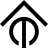                        | Tasmota                                   | [Source](https://github.com/arendst/Tasmota/blob/master/tools/logo/TASMOTA_Symbol_Vector.svg)                                                         |                                                                                                                                                           |
|                        | Tautulli                                  | [Source](https://github.com/Tautulli/Tautulli/blob/master/data/interfaces/default/images/logo.svg)                                                    |                                                                                                                                                           |
|                        | Telegram                                  | [Source](https://telegram.org/tour/screenshots)                                                                                                       | [Guidelines](https://telegram.org/tour/screenshots)                                                                                                       |
|                         | Tenable                                   | [Source](https://www.tenable.com/media)                                                                                                               | [Guidelines](https://www.tenable.com/media)                                                                                                               |
|                       | Terraform                                 | [Source](https://www.hashicorp.com/brand)                                                                                                             | [Guidelines](https://www.hashicorp.com/brand)                                                                                                             |
|                       | TeslaMate                                 | [Source](https://github.com/adriankumpf/teslamate/blob/master/website/static/img/logo.svg)                                                            |                                                                                                                                                           |
|                  | The Lounge (dark)                         | [Source](https://github.com/thelounge/thelounge/blob/master/client/img/logo-transparent-bg.svg)                                                       |                                                                                                                                                           |
|                 | The Lounge (light)                        | [Source](https://github.com/thelounge/thelounge/blob/master/client/img/logo-transparent-bg-inverted.svg)                                              |                                                                                                                                                           |
|                          | TikTok                                    | [Source](https://en.wikipedia.org/wiki/TikTok)                                                                                                        | [Guidelines](https://tiktokbrandbook.com/)                                                                                                                |
|                       | TinyPilot                                 | [Source](https://tinypilotkvm.com/)                                                                                                                   |                                                                                                                                                           |
|                     | TinyTinyRSS (TT-RSS)                      | [Source](https://gitlab.com/prism-break/prism-break/-/blob/master/source/assets/logos/tt-rss.svg)                                                     |                                                                                                                                                           |
|                            | TOML                                      | [Source](https://github.com/toml-lang/toml/blob/main/logos/toml.svg)                                                                                  |                                                                                                                                                           |
|                      | Tor Browser                               | [Source](https://styleguide.torproject.org/brand-assets/)                                                                                             | [Guidelines](https://styleguide.torproject.org/brand-assets/)                                                                                             |
|                      | Tor Project                               | [Source](https://styleguide.torproject.org/brand-assets/)                                                                                             | [Guidelines](https://styleguide.torproject.org/brand-assets/)                                                                                             |
|                          | TP-Link                                   | [Source](https://www.tp-link.com/)                                                                                                                    |                                                                                                                                                           |
|                  | Traefik (gopher)                          | [Source](https://github.com/traefik/traefik/blob/master/webui/src/assets/traefik.avatar.svg)                                                          |                                                                                                                                                           |
|                   | Traefik (proxy)                           | [Source](https://traefik.io/traefik/)                                                                                                                 |                                                                                                                                                           |
|                           | Trakt                                     | [Source](https://trakt.tv/branding)                                                                                                                   | [Guidelines](https://trakt.tv/branding)                                                                                                                   |
|                    | Transmission                              | [Source](https://en.wikipedia.org/wiki/Transmission_(BitTorrent_client))                                                                              |                                                                                                                                                           |
|                        | TravisCI                                  | [Source](https://blog.travis-ci.com/2014-11-20-brand-stand)                                                                                           |                                                                                                                                                           |
|                         | TrueNAS                                   | [Source](https://www.truenas.com/)                                                                                                                    |                                                                                                                                                           |
|                   | TrueNAS Scale                             | [Source](https://github.com/truenas/webui/blob/master/src/assets/customicons/truenas_scale_logomark_rgb.svg)                                          |                                                                                                                                                           |
|                        | TubeSync                                  | [Source](https://github.com/meeb/tubesync/blob/main/tubesync/common/templates/tubesync-coloured.svg)                                                  |                                                                                                                                                           |
|                          | Twitch                                    | [Source](https://brand.twitch.tv/)                                                                                                                    | [Guidelines](https://brand.twitch.tv/)                                                                                                                    |
|                         | Twitter                                   | [Source](https://about.twitter.com/en/who-we-are/brand-toolkit)                                                                                       | [Guidelines](https://about.twitter.com/en/who-we-are/brand-toolkit)                                                                                       |
|                        | Ubiquiti                                  | [Source](https://store.ui.com/)                                                                                                                       |                                                                                                                                                           |
|                           | Umami                                     | [Source](https://github.com/umami-software/umami/blob/master/assets/logo.svg)                                                                         |                                                                                                                                                           |
|                         | Unbound                                   | [Source](https://www.nlnetlabs.nl/projects/unbound/about/)                                                                                            |                                                                                                                                                           |
| 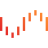                         | Unraid                                    | [Source](https://unraid.net/)                                                                                                                         |                                                                                                                                                           |
|                      | Uptime Kuma                               | [Source](https://github.com/louislam/uptime-kuma/blob/master/public/icon.svg)                                                                         |                                                                                                                                                           |
|                         | Vagrant                                   | [Source](https://www.hashicorp.com/brand)                                                                                                             | [Guidelines](https://www.hashicorp.com/brand)                                                                                                             |
|                           | Vault                                     | [Source](https://www.hashicorp.com/brand)                                                                                                             | [Guidelines](https://www.hashicorp.com/brand)                                                                                                             |
|                     | Vaultwarden                               | [Source](https://github.com/dani-garcia/vaultwarden/blob/main/resources/vaultwarden-icon.svg)                                                         |                                                                                                                                                           |
| 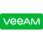                          | Veeam                                     | [Source](https://www.veeam.com/newsroom/veeam-graphics.html)                                                                                          |                                                                                                                                                           |
|                    | Vercel (black)                            | [Source](https://vercel.com/design/brands)                                                                                                            | [Guidelines](https://vercel.com/design/brands#usage)                                                                                                      |
|                    | Vercel (white)                            | [Source](https://vercel.com/design/brands)                                                                                                            | [Guidelines](https://vercel.com/design/brands#usage)                                                                                                      |
|           | VictoriaMetrics (black)                   | [Source](https://docs.victoriametrics.com/#victoriametrics-logo)                                                                                      | [Guidelines](https://docs.victoriametrics.com/#victoriametrics-logo)                                                                                      |
|           | VictoriaMetrics (white)                   | [Source](https://docs.victoriametrics.com/#victoriametrics-logo)                                                                                      | [Guidelines](https://docs.victoriametrics.com/#victoriametrics-logo)                                                                                      |
|                             | Vim                                       | [Source](https://en.wikipedia.org/wiki/Vim_(text_editor))                                                                                             |                                                                                                                                                           |
|                         | Vikunja                                   | [Source](https://vikunja.io/)                                                                                                                         |                                                                                                                                                           |
|                | Visual Studio Code                        | [Source](https://code.visualstudio.com/brand)                                                                                                         |                                                                                                                                                           |
|                             | VLC                                       | [Source](https://en.wikipedia.org/wiki/VLC_media_player)                                                                                              |                                                                                                                                                           |
|                          | VMWare                                    | [Source](https://en.wikipedia.org/wiki/VMware)                                                                                                        |                                                                                                                                                           |
|                      | Vultr (blue)                              | [Source](https://www.vultr.com/company/brand-assets/)                                                                                                 | [Guidelines](https://www.vultr.com/company/brand-assets/)                                                                                                 |
|                     | Vultr (white)                             | [Source](https://www.vultr.com/company/brand-assets/)                                                                                                 | [Guidelines](https://www.vultr.com/company/brand-assets/)                                                                                                 |
|                            | VyOS                                      | [Source](https://vyos.io/)                                                                                                                            |                                                                                                                                                           |
|                      | Watchtower                                | [Source](https://github.com/containrrr/watchtower/discussions/1513)                                                                                   |                                                                                                                                                           |
|                        | Waypoint                                  | [Source](https://www.hashicorp.com/brand)                                                                                                             | [Guidelines](https://www.hashicorp.com/brand)                                                                                                             |
|                           | Wazuh                                     | [Source](https://github.com/wazuh/wazuh-documentation/blob/develop/source/_themes/wazuh_doc_theme_v3/static/images/favicon.svg)                       |                                                                                                                                                           |
|                      | Wazuh (wide)                              | [Source](https://wazuh.com/)                                                                                                                          |                                                                                                                                                           |
|                      | Weaveworks                                | [Source](https://www.weave.works/)                                                                                                                    |                                                                                                                                                           |
|                           | Wekan                                     | [Source](https://github.com/wekan/wekan/blob/main/public/svg-etc/wekan-logo-512.svg)                                                                  |                                                                                                                                                           |
|                        | WhatsApp                                  | [Source](https://about.meta.com/brand/resources/whatsapp/whatsapp-brand/)                                                                             | [Guidelines](https://about.meta.com/brand/resources/whatsapp/whatsapp-brand/)                                                                             |
|                        | Whisparr                                  | [Source](https://github.com/Whisparr/Whisparr/blob/develop/Logo/Whisparr.svg)                                                                         |                                                                                                                                                           |
|                       | Wikipedia                                 | [Source](https://en.wikipedia.org/wiki/Wikipedia:Wikipedia_logos)                                                                                     | [Guidelines](https://en.wikipedia.org/wiki/Wikipedia:Wikipedia_logos)                                                                                     |
|                          | Wiki.js                                   | [Source](https://js.wiki/)                                                                                                                            |                                                                                                                                                           |
|                        | Windows 8                                 | [Source](https://en.wikipedia.org/wiki/Windows_8)                                                                                                     |                                                                                                                                                           |
|                       | Windows 10                                | [Source](https://en.wikipedia.org/wiki/Windows_10)                                                                                                    |                                                                                                                                                           |
|                       | Windows 11                                | [Source](https://en.wikipedia.org/wiki/Windows_11)                                                                                                    |                                                                                                                                                           |
|                       | WireGuard                                 | [Source](https://www.wireguard.com/trademark-policy/)                                                                                                 | [Guidelines](https://www.wireguard.com/trademark-policy/)                                                                                                 |
|                          | Wizarr                                    | [Source](https://github.com/wizarrrr/wizarr/blob/master/apps/wizarr-frontend/src/assets/img/wizarr-logo.svg)                                          |                                                                                                                                                           |
|                    | Woodpecker CI                             | [Source](https://github.com/woodpecker-ci/woodpecker/blob/master/docs/static/img/logo.svg)                                                            |                                                                                                                                                           |
|               | Woodpecker CI (full)                      | [Source](https://github.com/woodpecker-ci/woodpecker/blob/master/docs/static/img/logo.svg)                                                            |                                                                                                                                                           |
|                       | WordPress                                 | [Source](https://wordpress.org/about/logos/)                                                                                                          | [Guidelines](https://wordpress.org/about/logos/)                                                                                                          |
|                         | X (black)                                 | [Source](https://about.twitter.com/en/who-we-are/brand-toolkit)                                                                                       | [Guidelines](https://about.twitter.com/en/who-we-are/brand-toolkit)                                                                                       |
|                         | X (white)                                 | [Source](https://about.twitter.com/en/who-we-are/brand-toolkit)                                                                                       | [Guidelines](https://about.twitter.com/en/who-we-are/brand-toolkit)                                                                                       |
|                           | XCP-NG                                    | [Source](https://vates.fr/blog/vates-brand-guidelines/)                                                                                               | [Guidelines](https://vates.fr/blog/vates-brand-guidelines/)                                                                                               |
|                            | XFCE                                      | [Source](https://www.xfce.org/download)                                                                                                               |                                                                                                                                                           |
|                           | Yacht                                     | [Source](https://github.com/SelfhostedPro/Yacht/blob/master/frontend/src/assets/logo-light.svg)                                                       |                                                                                                                                                           |
|                            | YAML                                      | [Source](https://yaml.org/)                                                                                                                           |                                                                                                                                                           |
|                            | Yarn                                      | [Source](https://github.com/yarnpkg/assets/blob/master/yarn-kitten-circle.svg)                                                                        |                                                                                                                                                           |
|                         | YouTube                                   | [Source](https://en.wikipedia.org/wiki/YouTube)                                                                                                       | [Guidelines](https://www.youtube.com/howyoutubeworks/resources/brand-resources/#logos-icons-and-colors)                                                   |
|                     | Y Combinator                              | [Source](https://en.wikipedia.org/wiki/Y_Combinator)                                                                                                  |                                                                                                                                                           |
|                          | Z Shell (ZSH)                             | [Source](https://en.wikipedia.org/wiki/Z_shell)                                                                                                       |                                                                                                                                                           |
|                           | Z-Wave                                    | [Source](https://en.wikipedia.org/wiki/Z-Wave)                                                                                                        |                                                                                                                                                           |
|                          | Zabbix                                    | [Source](https://github.com/zabbix/zabbix/blob/master/sass/img/icon-sprite.svg)                                                                       | [Guidelines](https://www.zabbix.com/logo)                                                                                                                 |
|                     | Zabbix (wide)                             | [Source](https://www.zabbix.com/logo)                                                                                                                 | [Guidelines](https://www.zabbix.com/logo)                                                                                                                 |
|                         | ZeroSSL                                   | [Source](https://zerossl.com/)                                                                                                                        |                                                                                                                                                           |
|                          | Zigbee                                    | [Source](https://zigbeealliance.org/wp-content/uploads/2019/11/Zigbee-Alliance-Trademark-and-Logo-Policy.pdf)                                         | [Guidelines](https://zigbeealliance.org/wp-content/uploads/2019/11/Zigbee-Alliance-Trademark-and-Logo-Policy.pdf)                                         |
